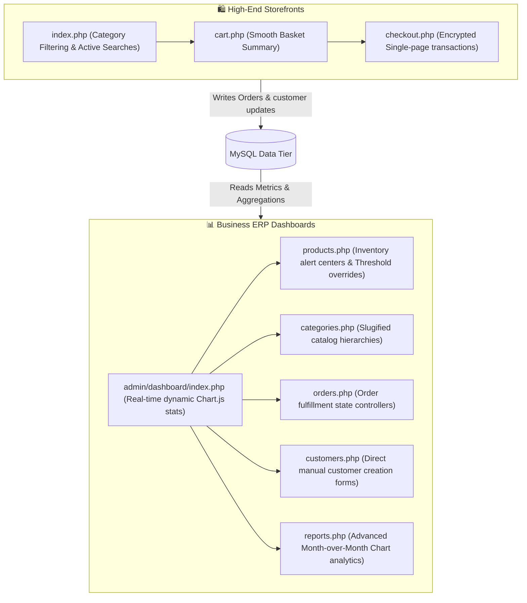

# 🌌 NexisERP: Multi-Tenant E-Commerce & ERP SaaS Platform

[](http://hareramkushwah.infinityfree.io/)
[](https://www.php.net/)
[](https://www.mysql.com/)
[](https://getbootstrap.com/)
[](LICENSE)

NexisERP is a high-performance, dynamic, and state-of-the-art **Multi-Tenant E-commerce and ERP SaaS platform** designed for modern digital commerce. Powered by a dynamic PHP 8 core, MySQL, and a luxury dark glassmorphic design system using the Outfit typography, NexisERP delivers an enterprise-grade experience for storefront shoppers and merchant administrators alike.

---

## 🔗 Live Interactive Demos

Explore the fully hosted live deployment in the cloud:

*   **SaaS Central Landing Hub**: [http://hareramkushwah.infinityfree.io/](http://hareramkushwah.infinityfree.io/)
*   **🛍️ Electronics Storefront**: [http://hareramkushwah.infinityfree.io/?store=electronics](http://hareramkushwah.infinityfree.io/?store=electronics)
*   **🛍️ Clothing Boutique Storefront**: [http://hareramkushwah.infinityfree.io/?store=clothing](http://hareramkushwah.infinityfree.io/?store=clothing)
*   **📊 Merchant ERP Back-Office**: [http://hareramkushwah.infinityfree.io/admin/index.php?store=electronics](http://hareramkushwah.infinityfree.io/admin/index.php?store=electronics)

### 🔑 Sandbox Admin Credentials
To test the back-office analytics, dynamic graphs, category editors, and invoice fullfilment:
*   **Username**: `admin@electronics.com` (for Electronics) or `admin@clothing.com` (for Clothing)
*   **Secure Password**: `password`

---

## 🎨 Platform Showcases & Architecture

The platform features a **premium glassmorphic theme** characterized by semi-transparent backdrops (`backdrop-filter: blur()`), vibrant linear gradients, responsive grids, and subtle micro-animations that respond seamlessly to user interaction.



---

## ✨ Features & Capabilities

### 🛍️ Public E-Commerce Storefront
*   **Active Subdomain Routing**: Dynamic merchant routing powered by subdomain hostname parsing (`getCurrentStore()`), enabling fully isolated online store presence.
*   **Keyword Catalog Searches**: Secure prepared-statement query matching over product names and descriptions.
*   **Taxonomy Filters**: Dynamic side-bar navigation with category-specific collections matching custom slug URLs.
*   **Stock Status Controls**: Automated indicators alerting shoppers of low-stock thresholds in real-time.
*   **Transactional checkout**: Single-page secure orders executing atomic inventory deductions and customer mapping.

### 📊 Back-Office Merchant ERP
*   **Dynamic Interactive KPI Metrics**: Automated revenue tracking, order tallies, and inventory alert tallies.
*   **Chart.js Business Intelligence**:
    *   **Revenue Velocity MoM**: Beautiful linear trend chart of monthly billing.
    *   **Distribution Shares**: Doughnut chart charting sales distribution share per product category.
*   **Invoicing & Fulfillment Control**: Comprehensive order state controllers (Pending, Processing, Shipped, Delivered, Cancelled) and payment status updates (Unpaid, Paid, Refunded).
*   **Unified Customer Directory**: Profiles lifetime purchases, delivery addresses, registration dates, and handles manual back-office registrations.

---

## 📂 Architecture and Directory Layout

```text
/erp_saas
│   database.sql             <- High-fidelity MySQL database schema & rich seed data
│   index.php                <- Dynamic Multi-tenant Storefront landing page
│   cart.php                 <- Shopping cart collection
│   checkout.php             <- Atomic transaction order engine
│   saas_landing.php         <- Core platform overview & merchant registration
│   register.php             <- Secure new merchant signups
│
├───admin                    <- Back-office entry routes
│   │   index.php            <- Luxury dark glassmorphic Admin login page
│   └───dashboard            <- ERP Merchant modules
│           index.php        <- Main KPIs & Sales velocity charts
│           products.php     <- Complete inventory catalog list
│           product_add.php  <- Create item specification form
│           product_edit.php <- Update item pricing, thresholds, & metadata
│           categories.php   <- Category taxonomy overview
│           category_add.php <- Create slugified collection form
│           category_edit.php<- Modify category properties
│           orders.php       <- Fulfillment shipping queue
│           order_details.php<- Invoicing & shipping profile panel
│           customers.php    <- Unified client profile folder & direct signups
│           reports.php      <- MoM sales charts & category share distributions
│
└───includes                 <- System engine & core files
        config.php           <- Environment config parameters
        db.php               <- Dynamic DB connection loader (supports environmental overrides)
        functions.php        <- Shared domain parsing, helpers, & sanitize filters
```

---

## 🛠️ Local Installation & Setup

### 1. Database Provisioning
Import the seed database schema into your local environment:
```bash
mysql -u your_username -p your_database_name < database.sql
```

### 2. Environment Configuration
Open `includes/config.php` and configure your database parameters:
```php
// Database configuration
define('DB_HOST', 'localhost');
define('DB_NAME', 'erp_saas');
define('DB_USER', 'root');
define('DB_PASS', '');

// Base URL configuration (without trailing slash)
define('BASE_URL', 'http://localhost/erp_saas');
```

### 3. Start Local Development Server
Execute a local PHP dev server directly from the workspace root:
```bash
php -S localhost:8000
```

---

## 👨‍💻 Creator & Contact

**Hareram Kushwaha**
*   **Portfolio Website**: [hareramkushwaha.com.np](https://hareramkushwaha.com.np)
*   **GitHub**: [@ha-re-ram](https://github.com/ha-re-ram)
*   **LinkedIn**: [in/ha-re-ram](https://linkedin.com/in/ha-re-ram)
*   **Email**: [hareramkushwaha054@gmail.com](mailto:hareramkushwaha054@gmail.com)

Feel free to connect or reach out for collaborations!

---

## 📄 License & Standards

This project is open-source software licensed under the [MIT License](LICENSE). 
Contributions must follow the guidelines outlined in [CONTRIBUTING.md](CONTRIBUTING.md).
For vulnerability reports, please review our [Security Policy](SECURITY.md).

---

## 🏷️ Tags & Keywords
`#php8` `#mysql` `#saas` `#multi-tenancy` `#erp-system` `#ecommerce-platform` `#chartjs` `#glassmorphism` `#web-development` `#software-architecture` `#clean-code` `#bootstrap5`

